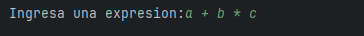
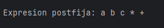
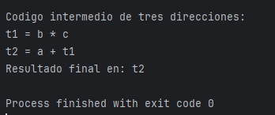

# Código intermedio de 3 direcciones

---

Desarrollo de programa básico en `Clion` de generación de código intermedio de tres direcciones,
- Lenguaje utilizado `C++`

---
## 📷 Capturas

---
- 1) Ingresando expresión: a + b * c

- 2) El programa convierte la expresión en postfija para poder generar el codigo de tres direcciones 

- 3) Se genera el codigo de tres direcciones a partir de la expresión -> postfija
